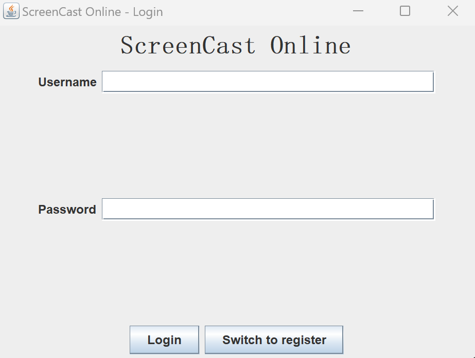
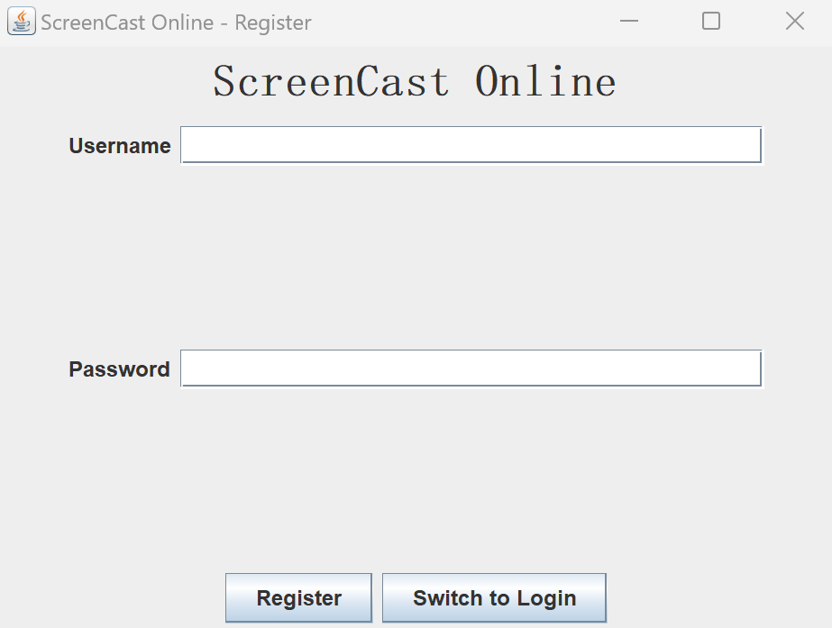
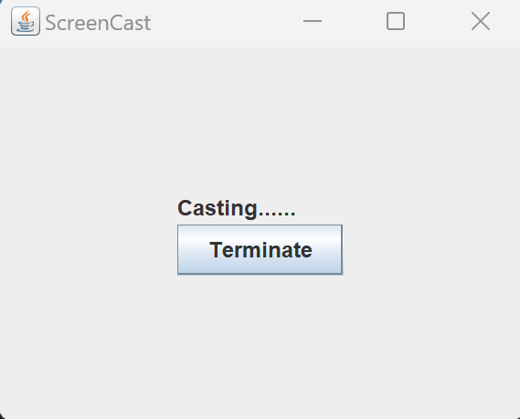
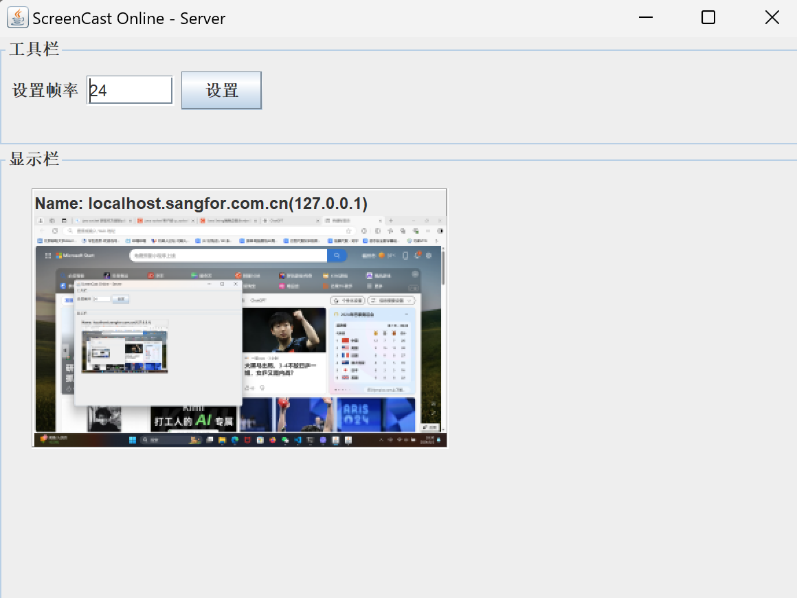
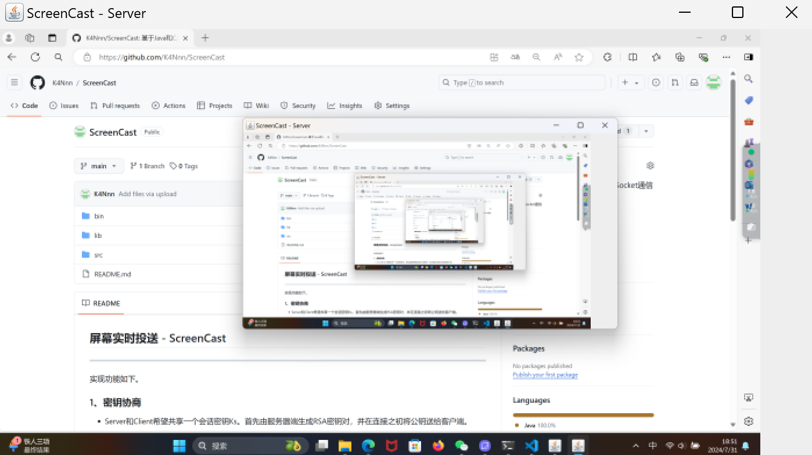

## 屏幕实时投送 - ScreenCast
------------
实现功能如下。
### 1、密钥协商

- Server和Client希望共享一个会话密钥Ks。首先由服务器端生成RSA密钥对，并在连接之初将公钥送给客户端。
- 随后客户端使用公钥加密Client生成的会话密钥送给Server，Server使用私钥解密。
- 同时，Client、Server应当附上身份验证信息。eg. 随机数验证
- 如何证明身份？发送信息包括RSA加密的AES会话密钥（还可携带AES会话密钥的Hash值）

Tip:1）在AES、RSA算法中。各密钥的存储都以Base64编码形式。即：传输，存储的过程中基本都是Base64编码。
    2）RSA类是类方法，而AES类是对象方法。

### 2、通信流程
- Server端启动后，监听来自Client的Socket通信连接（多线程）。控制显示的屏幕投送图片比例保持，不受缩放影响。
- Client成功登录后，启动屏幕内容捕获并投送至Server端（可以在client/ScreenCaptureSender.java下，修改传送帧率）。采用JNA库，以实现屏幕截图。亦可使用awt下的Robot类，虽然分辨率有些低。

### 3、C/S模式
- 实现客户端登陆界面、服务器端存储数据于数据库。
- 数据库采用MySQL；连接配置见server/DatabaseConnector.java

### 4、运行
1. 编译命令：
   
        javac -cp "lib/mysql-connector-j-9.0.0.jar;lib/jna-5.14.0.jar;lib/jna-platform-5.14.0.jar;src" -d bin -encoding UTF-8 src/server/*.java src/client/*.java src/cryptoUtils/*.java

2. 运行命令： 
    （[CONNECTION_IP_ADDRESS]：欲连接IP地址；[CONNECTION_PORT]：欲连接端口号）  
    server端：

        java -cp "bin;lib/mysql-connector-j-9.0.0.jar;lib/jna-5.14.0.jar;lib/jna-platform-5.14.0.jar" server.ServerTest [CONNECTION_PORT]
    client端：

        java -cp "bin;lib/mysql-connector-j-9.0.0.jar;lib/jna-5.14.0.jar;lib/jna-platform-5.14.0.jar" client.ClientTest [CONNECTION_IP_ADDRESS] [CONNECTION_PORT]

    例如：

        java -cp "bin;lib/mysql-connector-j-9.0.0.jar;lib/jna-5.14.0.jar;lib/jna-platform-5.14.0.jar" client.ClientTest localhost 40101

3. 直接使用.jar文件 
    server端：

        java -jar ScreenCast-server.jar [CONNECTION_PORT]
    client端：

        java -jar ScreenCast-server.jar [CONNECTION_IP_ADDRESS] [CONNECTION_PORT]

### 5、界面示例
*登陆界面*

---
*注册界面*

---
*客户端浮窗（运行时）*

---
*服务器端界面*

